<a href="https://shivamjisorya.github.io/Portfolio/">
  
</a>

<p align="center">
  <a href="https://shivamjisorya.github.io/Portfolio/"></a>
  <a href="https://www.linkedin.com/in/shivam-jisorya-22107a204/"></a>
  <a href="mailto:jisoryas26@gmail.com"></a>
  <a href="https://shivamjisorya.github.io/Portfolio/resume.pdf"></a>
</p>

<br />


<p align="center">
  <a href="https://shivamjisorya.github.io/Portfolio/"></a>
  <a href="https://www.linkedin.com/in/shivam-jisorya-22107a204/"></a>
  <a href="https://github.com/shivamjisorya?tab=repositories"></a>
  <a href="https://shivamjisorya.github.io/Portfolio/"></a>
</p>



<br /><br />


<a href="https://shivamjisorya.github.io/Portfolio/">
  
</a>

<br /><br />


<p align="center">
  <a href="https://shivamjisorya.github.io/Portfolio/"></a>
  <a href="https://github.com/shivamjisorya/pos-software"></a>
  <a href="https://shivamjisorya.github.io/Portfolio/"></a>
</p>
<p align="center">
  <a href="https://github.com/shivamjisorya/shree-ram-precast"></a>
  <a href="https://shivamjisorya.github.io/Portfolio/"></a>
  <a href="https://shivamjisorya.github.io/Portfolio/"></a>
</p>


<p align="center">
  
  <br />
  
</p>

<br />



<br /><br />


```js
const shivam = {
  now:        "SDE-1 @ Digital Paani",
  building:   ["Trigger Engine", "CI/CD pipelines", "POS Software"],
  learning:   "Full Stack AI Engineering (B.Tech CSE, MDU)",
  askMeAbout: ["React", "Node.js", "GitHub Actions", "AWS"],
  offScreen:  ["♟ chess", "🎧 music"],
  funFact:    "The toughest thing on earth? Centering a div. 😂",
};
```

<picture>
  <source media="(prefers-color-scheme: dark)" srcset="https://raw.githubusercontent.com/shivamjisorya/shivamjisorya/output/github-snake-dark.svg" />
  <source media="(prefers-color-scheme: light)" srcset="https://raw.githubusercontent.com/shivamjisorya/shivamjisorya/output/github-snake.svg" />
  
</picture>

<br /><br />

<a href="https://shivamjisorya.github.io/Portfolio/">
  
</a>

<p align="center">
  <a href="https://shivamjisorya.github.io/Portfolio/"></a>
  <a href="https://www.linkedin.com/in/shivam-jisorya-22107a204/"></a>
  <a href="mailto:jisoryas26@gmail.com"></a>
</p>
